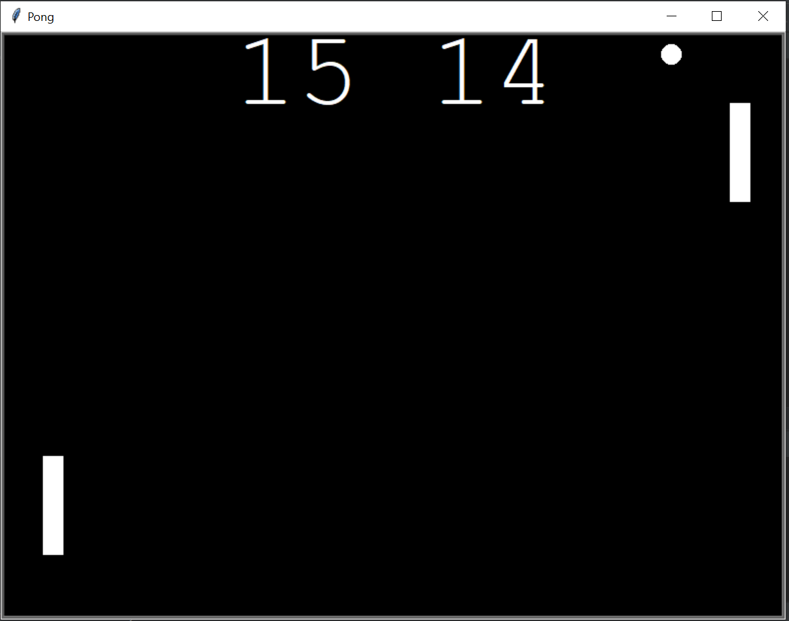

# Pong Game

Welcome to Pong! Pong is a classic arcade game where two players control paddles on either side of the screen to hit a ball back and forth. The objective is to score points by successfully hitting the ball past your opponent's paddle.

## How to Play

1. **Objective**: The objective of the game is to outscore your opponent by hitting the ball past their paddle.

2. **Controls**:
   - Player 1 (Left Paddle):
     - Move Up: Press the 'W' key
     - Move Down: Press the 'S' key
   - Player 2 (Right Paddle):
     - Move Up: Press the up arrow key
     - Move Down: Press the down arrow key

3. **Gameplay**:
   - The game starts with the ball in the center of the screen, and each player's paddle positioned on their respective sides.
   - The ball will start moving in a random direction.
   - Players control their paddles to hit the ball back and forth.
   - If a player fails to hit the ball and it passes their paddle, the opposing player scores a point.
   - The game continues until one player reaches the set score limit or decides to end the game.

4. **Scoring**:
   - Each time the ball passes the opponent's paddle, the opposing player scores a point.
   - The game can be played to a predetermined score limit (e.g., first player to reach 10 points wins).

5. **Winning**:
   - The player who reaches the score limit first wins the game.

## How to Run

To run the Pong game, follow these steps:

1. Make sure you have Python installed on your system. You can download it from [here](https://www.python.org/downloads/).

2. Clone this repository to your local machine using the following command:

   ```bash
   git clone https://github.com/Ishay1997/Pong.git
   

